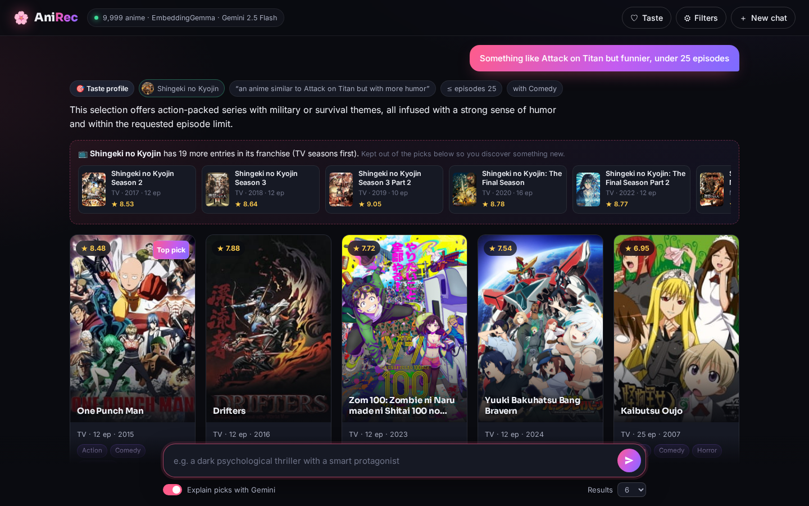
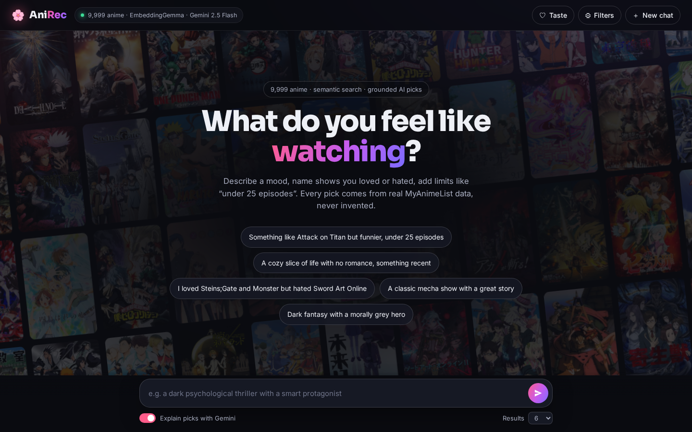
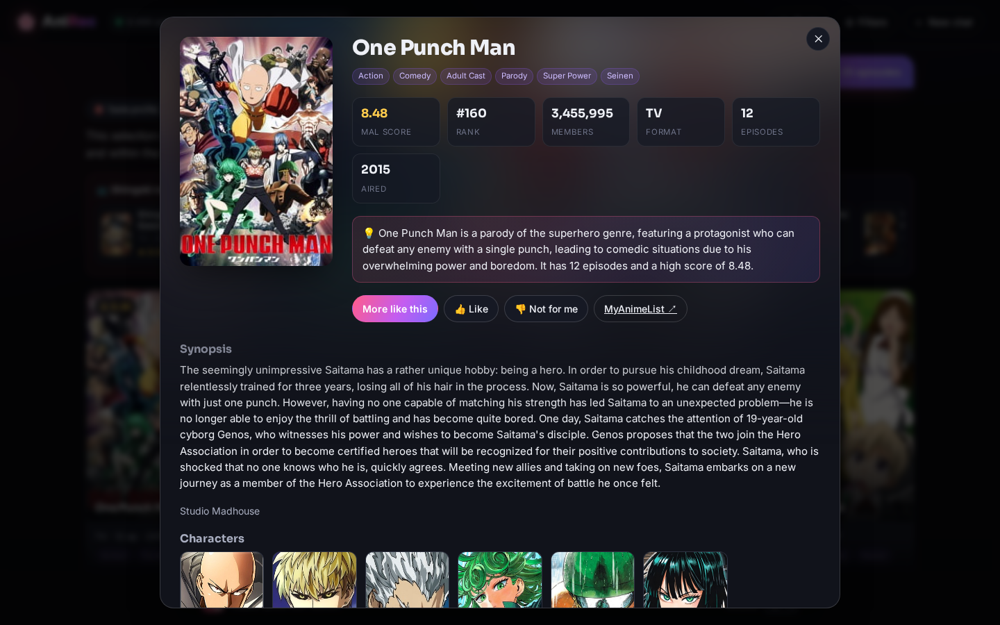
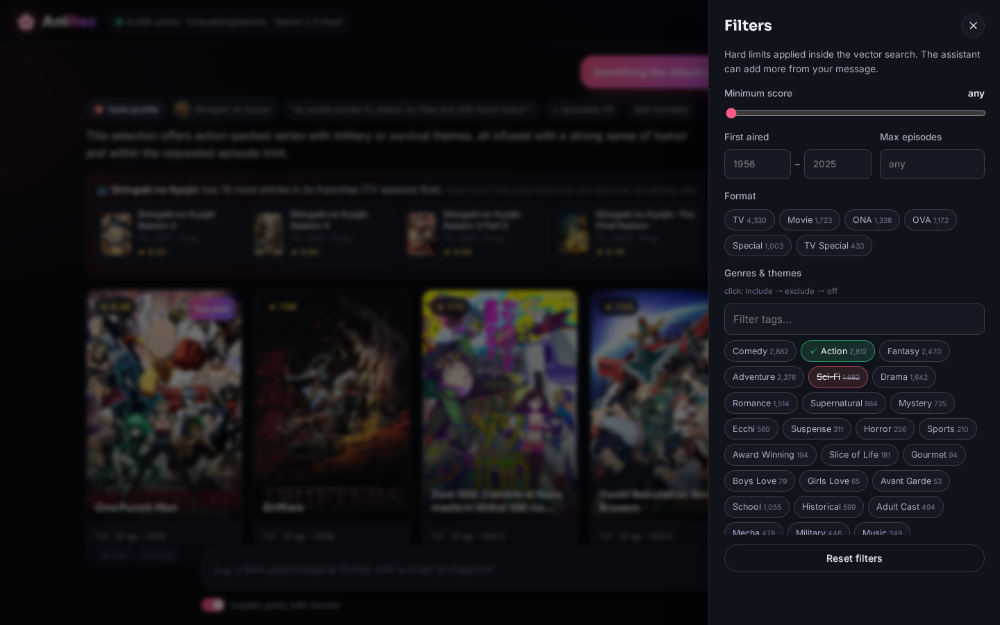
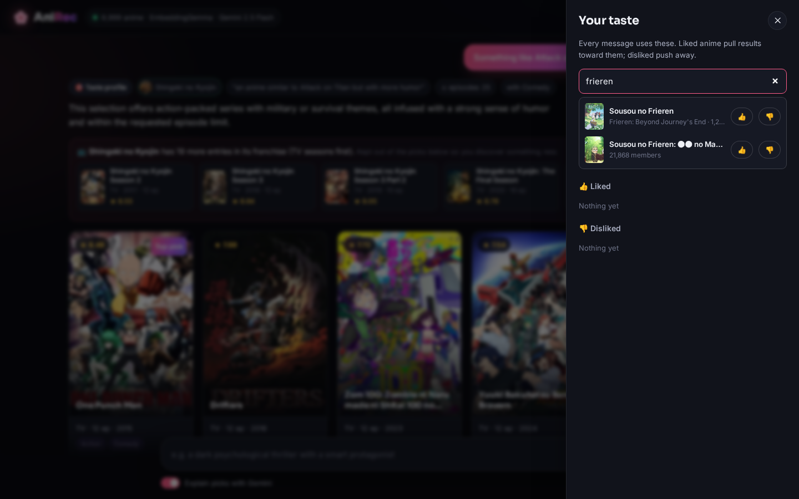
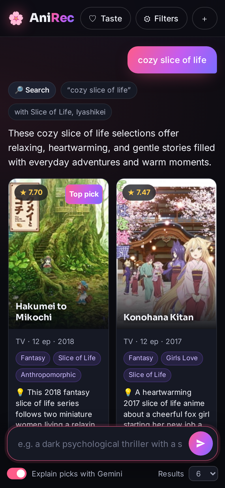
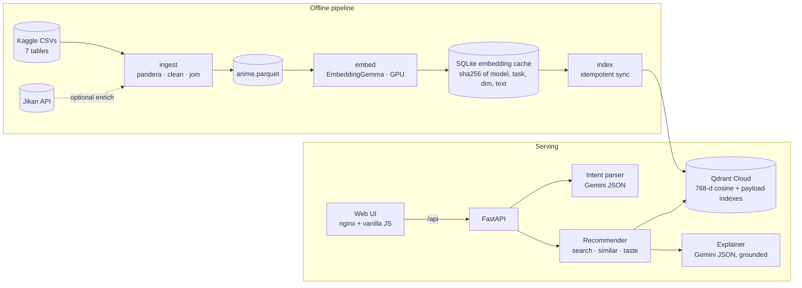

# 🌸 AniRec: chat-based anime recommendations

[](https://github.com/FurkanArikk/anime_recommendation/actions/workflows/ci.yml)


An end-to-end recommendation system over the **MyAnimeList top 10,000** anime, built on
a dataset I collected from MyAnimeList myself and
[published on Kaggle](https://www.kaggle.com/datasets/furkanark/myanimelist-top-10000-anime-dataset). You describe
what you feel like watching, e.g. *"something like Attack on Titan but funnier, under 25
episodes"*. Gemini turns that into a structured query. **Qdrant** runs a filtered vector
search over **EmbeddingGemma** embeddings (the model was picked by a measured evaluation).
Gemini then re-ranks the retrieved candidates and explains each pick, and it may only use
anime that were actually retrieved. The pipeline is idempotent and validated end to end,
with 161 tests, strict typing, CI, and a single `docker compose up`.



<details>
<summary>More screenshots: landing page, detail view, filters, taste profile, mobile</summary>

| | |
|---|---|
|  |  |
|  |  |


</details>

## Highlights

- **Model choice backed by an experiment.** Three open models and the Gemini API were compared
  on a 32-query benchmark. The local EmbeddingGemma tied the hosted API, so it won on cost. EmbeddingGemma with synopsis-only documents reached **MRR@10 0.82
  and Hit@10 1.00** on the full corpus, against 0.55 for the baseline ([details](docs/evaluation.md)).
- **Grounded LLM output.** Explanations use Gemini's structured JSON output, validated with
  pydantic. Any anime ID that wasn't retrieved is dropped in code, so the model can't
  recommend a title that doesn't exist.
- **Chat that understands intent.** Likes, dislikes, mood and hard limits are parsed from free
  text, then checked against the real catalog (unknown tags and impossible ranges are rejected).
- **Production-minded pipeline.** Every stage is idempotent and resumable. Point IDs are MAL
  IDs, embeddings are content-addressed in a cache, and data is validated with pandera schemas.
  Gemini rate limits are handled with server-directed backoff and a daily-quota circuit breaker.
- **Degrades gracefully.** Without Gemini the chat still works as semantic search. If a chat
  model is overloaded, a fallback model takes over.

## Architecture



| Layer | What it does |
|---|---|
| **Ingestion** | Joins the 7 normalized MAL tables into one row per anime. Fixes the data quality issues found during profiling: doubled genre names, placeholder studios, boilerplate synopses, duplicate rows. Validates input and output with pandera and writes parquet atomically. |
| **Embeddings** | Provider-agnostic: local sentence-transformers (CPU/GPU) or the Gemini API. Content-addressed cache committed per batch, so reruns cost nothing and crashes resume. |
| **Vector store** | Qdrant, cosine distance, MAL ID as point ID, payload indexes on every filterable field. The collection records its embedding model and refuses to mix models. |
| **Recommender** | Semantic search, similar-to, and taste profiles via Qdrant's recommend API (liked/disliked plus an optional text modifier). Collapses seasons of the same franchise so one show can't fill a page. The other seasons of an anime you liked are listed separately in a "continue the franchise" note, main TV seasons first. Item-based modes re-rank with tag overlap and a quality prior. |
| **LLM layer** | Gemini intent parsing and grounded re-rank/explanations, both structured output validated in code. Model fallback chain; thinking disabled on Gemini 2.5 (13.7 s → about 3 s). |
| **Serving** | FastAPI with typed models and OpenAPI docs, liveness and readiness probes. nginx serves the single-page app and proxies `/api`, with a strict CSP. |

## Tech stack

**Data:** pandas, pyarrow, pandera · **Embeddings:** sentence-transformers (EmbeddingGemma-300m),
google-genai · **Vector DB:** Qdrant · **LLM:** Gemini 2.5 Flash (structured output) ·
**API:** FastAPI, pydantic v2 · **UI:** HTML/CSS/ES modules on nginx · **Tooling:** uv, ruff,
mypy (strict), pytest, pre-commit (with gitleaks), GitHub Actions, Docker Compose, Playwright
(visual smoke test).

## Quick start

Requirements: Docker. A Qdrant cluster (the [free tier](https://cloud.qdrant.io) is enough)
or the bundled local Qdrant. A [Hugging Face token](https://huggingface.co/settings/tokens)
with the EmbeddingGemma license accepted. Optionally a
[Gemini API key](https://aistudio.google.com/apikey).

```bash
git clone https://github.com/FurkanArikk/anime_recommendation.git && cd anime_recommendation
make env                     # creates .env: fill in QDRANT_*, HF_TOKEN, GEMINI_API_KEY
# download the dataset from Kaggle (link below) and unzip it into data/raw/
# e.g.: kaggle datasets download furkanark/myanimelist-top-10000-anime-dataset -p data/raw --unzip
make ingest embed index      # add GPU=1 to embed on an NVIDIA GPU (~1 min vs ~15 min on CPU)
make up                      # UI: http://localhost:8080 · API docs: http://localhost:8000/docs
```

Everything runs in Docker; nothing is installed on the host. `make help` lists all commands.
To run without Qdrant Cloud, set `QDRANT_URL=http://qdrant:6333` and start with
`docker compose --profile local-qdrant up -d`. Production deployment is covered in
[docs/deployment.md](docs/deployment.md).

## Example queries

Real responses from the running system:

| Request | Understood as | Top results |
|---|---|---|
| *Something like Attack on Titan but funnier, under 25 episodes* | taste profile: *Shingeki no Kyojin* + "action with comedic elements"; ≤ 25 ep; tags Action, Comedy | Drifters · One Punch Man S2 · Assassination Classroom · Gintama. Porori-hen |
| *I loved Steins;Gate and Monster but hated Sword Art Online* | liked 2, disliked 1 | Erased · Subete ga F ni Naru · Babylon |
| *A classic mecha show with a great story* | Mecha, aired ≤ 2005, score ≥ 7.5 | Macross: Do You Remember Love? · Gundam SEED · Turn A Gundam · Giant Robo |
| *Heartwarming story about a found family* + UI filters TV, score ≥ 8, ≤ 26 ep | search | Fruits Basket · The Promised Neverland · Usagi Drop · Buddy Daddies · Clannad: After Story |
| **More like this** on *Steins;Gate* | similar-to (other Steins;Gate entries excluded) | Erased · The Tatami Time Machine Blues |

"Attack on Titan" resolves to the MAL romaji title *Shingeki no Kyojin*: the intent parser
suggests the official title, and the resolver checks it against the catalog.

Latency on a laptop CPU (the API does not use the GPU): search 70–400 ms; with Gemini
explanations about 2.5–4 s.

## API

| Endpoint | Purpose |
|---|---|
| `POST /chat` | Free-text turn: intent parsing → search, similar or taste → explanations. Returns what was understood. |
| `POST /search` | Semantic search with filters (`min_score`, `year_min/max`, `types`, `max_episodes`, `include_tags`, `exclude_tags`) |
| `POST /similar` | By `anime_id` or `title` |
| `POST /recommend` | Taste profile: `liked`, `disliked`, `strategy` |
| `GET /titles`, `/popular`, `/facets`, `/anime/{id}` | Autocomplete (romaji and English), landing page, filter options, detail |
| `GET /health`, `/ready` | Liveness; readiness (Qdrant reachable, models loaded) |

Every POST accepts `"explain": true` to add Gemini re-ranking and reasons. Interactive docs
are at `/docs`.

## Evaluation

| Model (full 9,999-anime corpus) | Template | Hit@5 | Hit@10 | MRR@10 |
|---|---|---|---|---|
| bge-base-en-v1.5 | full | 0.66 | 0.78 | 0.553 |
| bge-base-en-v1.5 | synopsis_only | 0.88 | 0.91 | 0.697 |
| bge-large-en-v1.5 | synopsis_only | 0.84 | 0.91 | 0.784 |
| embeddinggemma-300m | full | 0.91 | 0.97 | 0.776 |
| **embeddinggemma-300m** | **synopsis_only** | **0.94** | **1.00** | **0.822** |

Key findings:
- Leaving metadata out of the embedded text helps *every* model. Metadata went into payload
  filters and re-ranking instead.
- Model knowledge matters more than parameter count.
- Scores measured on only the best-known 970 anime overstate production quality.

The full write-up, including the comparison with the Gemini API and per-query ranks, is in
[docs/evaluation.md](docs/evaluation.md).

## Design decisions and trade-offs

- **Why Qdrant:** payload filtering happens *inside* the HNSW search, not as a post-filter,
  so "score ≥ 8, ≤ 26 episodes" doesn't starve the result list. It also offers native
  recommend queries with positive/negative examples, a managed free tier, and a local
  Docker image with the same API.
- **Why EmbeddingGemma instead of the Gemini embedding API:** the API was the original plan.
  But the free tier allows 1,000 texts per day (each text in a batch counts), and search
  queries share that quota, so indexing would take 10 days. The local model runs in about a
  minute on a GPU, has no per-query cost or quota, and **tied** with the API in the
  evaluation (MRR 0.953 vs 0.948 on the shared 970-anime subset). The code keeps both behind one `Embedder` interface, selected with
  `EMBEDDING_PROVIDER`.
- **Why deterministic IDs:** point ID = MAL anime ID, so re-indexing overwrites instead of
  duplicating. A sync step deletes points for anime that disappear from a re-scrape. The
  cache key is `sha256(model, task_type, dim, text)`, so editing a template or switching
  models can never serve stale vectors.
- **How rate limits are handled:** client-side throttling budgets *texts* per minute (verified
  against the API: a single 100-text batch uses the whole free-tier minute). Backoff honors the server's
  `RetryInfo` delay, with jittered exponential fallback. A *daily* quota error stops the run
  instead of retrying for hours, and progress stays cached. Jikan gets the same treatment,
  plus a circuit breaker for when MyAnimeList is down.
- **Grounding the LLM:** Gemini sees only the retrieved candidates, referred to by ID. Its
  output is schema-validated, invented IDs are removed in code, and summaries may not name
  titles. Gemini may skip candidates that clearly don't fit; any empty slots are then filled
  with retrieval results, shown without a reason, so it's visible which results the LLM
  actually endorsed.
- **Synopsis-only vectors plus a hybrid re-rank:** synopses capture plot premise but not tone.
  "Similar to Death Note" first returned other *death god* shows. Item-based modes therefore
  re-rank 80 candidates by cosine + tag overlap + a small quality prior. Text search stays
  pure cosine, which is what the evaluation measured.
- **Frontend without a build step:** a small vanilla-JS app is easy to audit, and all data
  and LLM text is inserted via `textContent`. Together with a CSP, that leaves no markup
  injection path. The trade-off is less component reuse than a framework would give.

## Project structure

```
src/anime_rec/
  ingestion/     pandera schemas, pure cleaning functions, Jikan enrichment
  embeddings/    Embedder base (cache, dedup, batching), local and Gemini providers, templates
  vectorstore/   Qdrant collection management and idempotent indexing
  recommender/   service, filters, titles/franchises, intent parser, explainer, chat routing
  api/           FastAPI app and HTTP schemas
  evaluation/    query set loader, metrics, model × template comparison
web/             static SPA + nginx config + Dockerfile
tests/           161 tests: in-memory Qdrant, fake embedders, faked Gemini, API tests
eval/            benchmark queries · docs/  evaluation, deployment, screenshots
```

## Development

```bash
make check        # ruff + ruff format --check + mypy --strict + pytest (in Docker)
make screenshots  # Playwright drives the UI, saves docs/screenshots, fails on browser errors
make eval GPU=1   # retrieval benchmark
```

CI (GitHub Actions) runs the same checks with a locked environment, then builds both images.
The tests need no network, GPU or API keys: Qdrant runs in memory, and embedders and Gemini
are faked.

## Limitations and future work

- **Hybrid sparse + dense search.** BM25 or SPLADE alongside dense vectors (Qdrant supports
  both) would help exact-name queries and rare terms.
- **User feedback loop.** Log likes and "not for me" clicks as implicit feedback, then learn
  re-rank weights from them instead of hand-tuning (tag weight 0.3, quality 0.05).
- **Collaborative filtering.** MAL user lists would enable "people who liked X also liked Y"
  as a second candidate source, blended with content similarity.
- **More evaluation coverage:** item-to-item similarity pairs, chat intent-parsing accuracy
  (the LLM parser is currently the least deterministic part), and more, externally written
  benchmark queries.
- **Data completeness.** The scrape is missing a main genre for 31% of anime and has no
  English titles. The Jikan `enrich` stage fixes both, but it depends on an unofficial API
  that is sometimes down. Its circuit breaker makes reruns safe.
- **Cross-encoder re-ranker** as a cheaper, deterministic alternative to LLM re-ranking.

## Data and license

**Data.** The dataset was collected from MyAnimeList by me and is published on Kaggle:
[**MyAnimeList Top 10,000 Anime Dataset**](https://www.kaggle.com/datasets/furkanark/myanimelist-top-10000-anime-dataset) (CC BY 4.0). It holds 10,000 anime
across 7 normalized tables: anime, genres, companies, characters, voice actors, staff and
entities, with ISO-8601 dates. This project covers the rest of the path: profiling
it, cleaning it and turning it into a recommender. Optional enrichment comes from [Jikan](https://jikan.moe).
Posters and character images are served from MyAnimeList's CDN and belong to their
respective rights holders. Code: [MIT](LICENSE).
